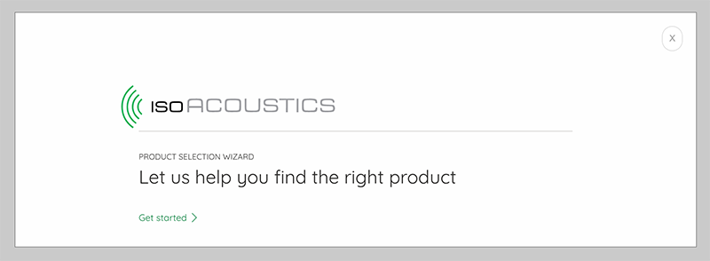
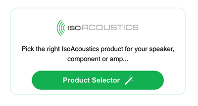

# isowrapper
Modal beautifier for eCommerce sites featuring IsoAcoustics product calculators




## Installation

Simply paste the following snippet wherever the launch button may be shown.
```
<input id="iso_text" type="hidden" value="Find the right product for you" />
<div id="iso_shell"></div>
<script src="./selector.js"></script>
```

Edit the `#iso_text` input value to amend the header text.



## Structure

All elements are built on the fly by `selector.js`.

If no custom text input is specified the heading will default to IsoAcoustics' generic slogan.
